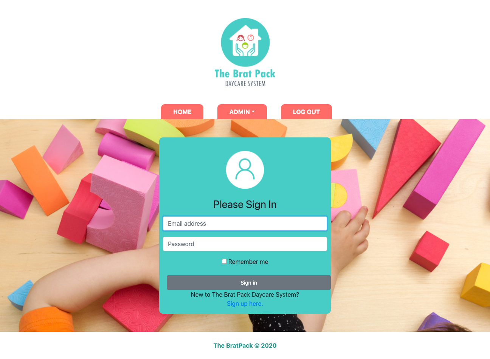

# Brat Pack: Daycare System

### Project Live URL: 
[Link to Demo](http://susanboratynska.com/brat-pack-daycare-system)

# Description:
Brat Pack is a Daycare System designed to simplify daily operating tasks for daycare staff. Application features include:
* Upcoming Field Trips
* Staff Directory
* Parent-Teacher Contact Forms
* Pick Up Scheduler
* Child Directory
* Messages
* Daycare Waitlist
* Menu
* Activities 

This was a 4 person group project. However, this repository only contains the code for the **Upcoming Field Trips** and **Staff Directory**. These features have full CRUD capabilities and have both an administrative and public views. 

## Technologies/Languages:
* PHP
* JavaScript
* CSS
* HTML
* Bootstrap
* jQuery
* mySQL
* phpMyAdmin

## Screenshot of Login Page:

